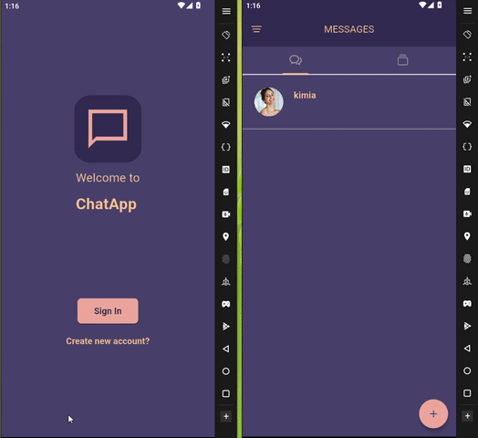

# 💬 Chattrix

### A Modern Full-Stack Real-Time & Offline Messaging Platform

**Chattrix** is a modern full-stack messaging application built with **Flutter** and **Node.js** that supports both **real-time** and **offline messaging**.

The application combines secure authentication, local storage, and a scalable backend architecture to deliver a smooth messaging experience across different network conditions.

Messages are stored locally using **Hive**, allowing users to continue using the application even without an internet connection. Once connectivity is restored, the application automatically synchronizes pending data with the server.

## 🎥 Demo

# 🚀 Features

- 🔐 JWT Authentication
- 👤 User Registration & Login
- 💬 Real-time One-to-One Chat
- 📦 Offline Messaging
- 🔄 Automatic Message Synchronization
- 🖼 Profile Picture Upload
- ⚡ Fast REST API
- 🔒 Secure Token-Based Authentication
- 🗂 Local Data Persistence
- ☁ MongoDB Database
- 📂 Image Upload using Multer

# 🛠 Tech Stack

## Mobile

- Flutter
- Dart
- GetX
- Hive
- HTTP Client

## Backend

- Node.js
- Express.js
- MongoDB
- Mongoose
- JWT
- Multer

